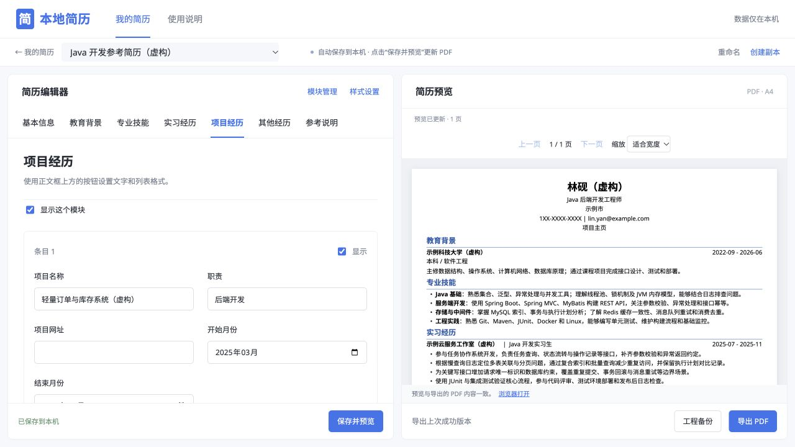
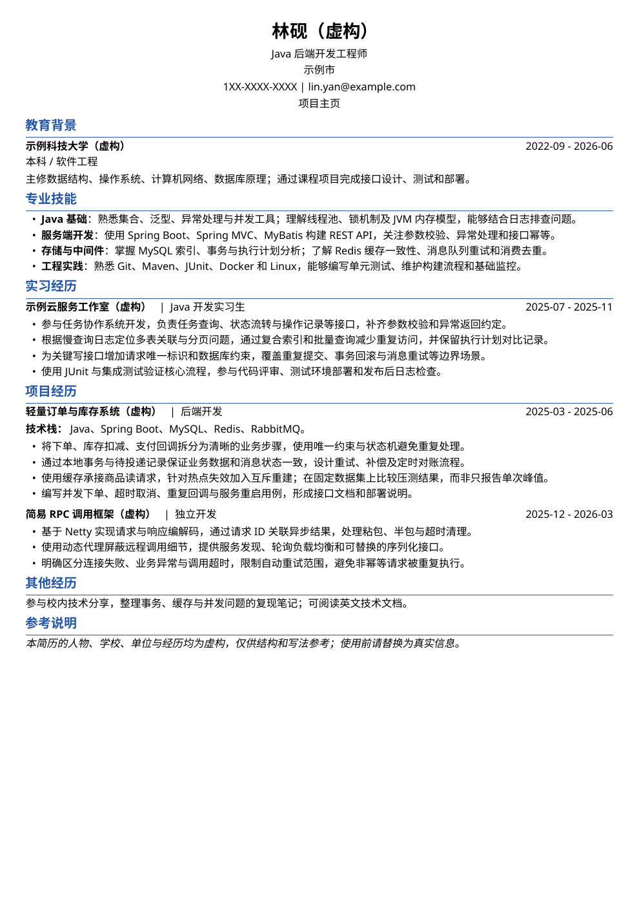
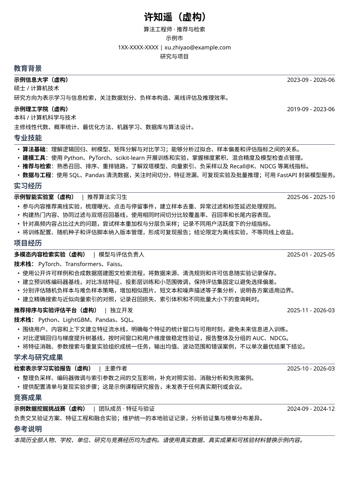
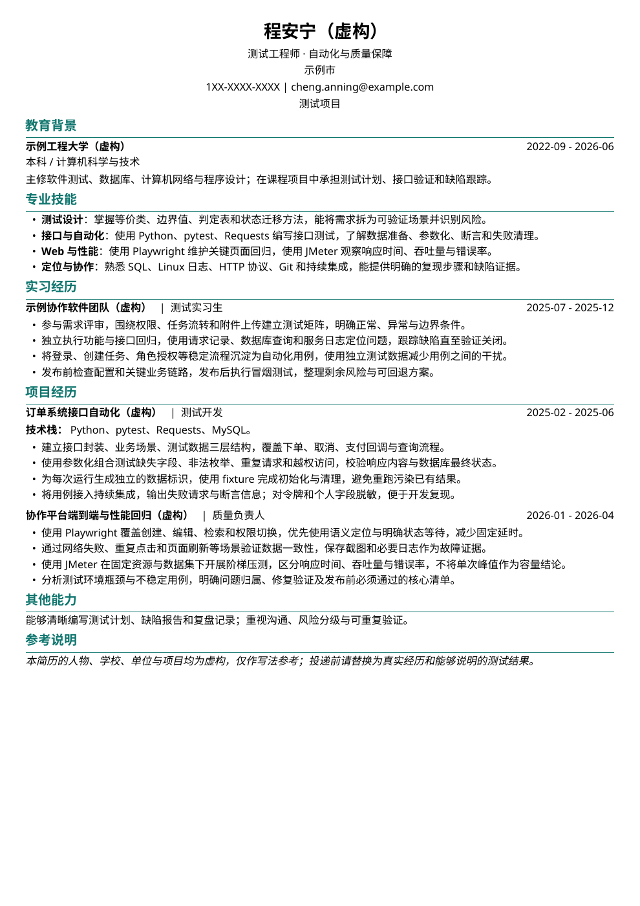
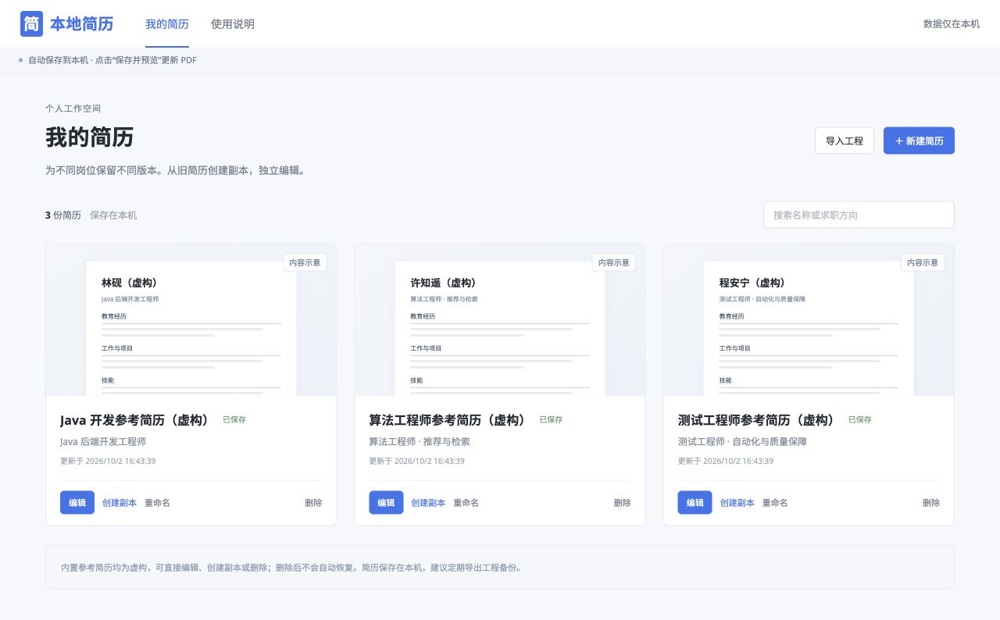

# 简墨 Jianmo Resume

**简墨（Jianmo Resume）是一款免费开源、在本机运行的简历编辑与管理工具。** 启动后，在浏览器中按模块填写教育背景、工作经历、项目和技能等内容，即可通过 LaTeX 生成排版整齐的简历，无需编写 LaTeX 代码。支持中文、英文及中英混合排版，点击“保存并预览”查看排版效果，确认后导出无水印 PDF。

你可以从内置的 Java、算法、测试参考简历开始，也可以新建空白简历，自定义模块顺序、主题色、字号、间距和头像。支持同时管理多份简历，从已有简历创建独立副本，为不同岗位调整内容而保留原稿。无需注册账号，内容自动保存到本机，PDF 也在本机编译，不上传简历到云端；通过工程备份可将可编辑的简历迁移到另一台电脑。

**Jianmo Resume is a free, open-source resume editor and manager that runs on your computer.** After starting the app, fill in sections such as education, work experience, projects, and skills in your browser. LaTeX handles the typesetting without requiring you to write LaTeX code. Create Chinese, English, or mixed-language resumes, click **Save & Preview** to check the layout, and export a watermark-free PDF.

Start with a built-in Java, algorithm, or QA reference resume, or create a blank one. Customize section order, colors, font sizes, spacing, and your photo. Keep multiple resumes and duplicate an existing one to tailor it for a different role without changing the original. No account is required: content is saved automatically on your computer, PDFs are compiled locally, and resumes are not uploaded to the cloud. Project backups let you transfer editable resumes to another computer.

[中文](#中文) · [English](#english) · [简历示例 / Examples](#examples)



<a id="中文"></a>
## 中文

### 功能

- **多份简历**：新建、搜索、复制、重命名和删除，为不同岗位保留独立版本。
- **自由组织内容**：教育、实习、项目、技能、获奖、学术、竞赛及自定义模块，支持排序和隐藏。
- **排版与配色**：36 种预设主题色、自定义颜色、字号、页边距和模块间距；内置中英文字体。
- **正文与头像**：加粗、斜体、列表、换行；上传头像后可拖动、缩放、旋转和裁剪。
- **保存与导出**：自动保存到本机，预览并导出 PDF，通过工程备份迁移简历。

### 安装与启动

环境：**Windows 11 x64**（本机验证 Python 3.12.6 x64）或 **macOS Apple Silicon**（Python 3.12+）。**无需安装完整 TeX、WSL 或 C++ 工具链。**

**Windows**：先安装 64 位 Python 3.12+ 和 Git，再在 PowerShell 执行：

```powershell
git clone https://github.com/StarWink0712/Jianmo-resume.git
cd Jianmo-resume
py -3 scripts/bootstrap.py
```

首次启动会自动创建 `.venv`、安装 Python 依赖、准备编译引擎并执行 PDF 自检，请联网等待几分钟。以后在项目目录运行以下命令即可离线启动：
也可以用ai帮你写一个启动脚本放到桌面，这样点击即可启动
```powershell
py -3 scripts/bootstrap.py --offline
```

也可使用 `.\scripts\start-local.ps1`。端口被占用时添加 `--port 8775`。保持终端运行，用 Edge 或 Chrome 打开 [http://127.0.0.1:8770/](http://127.0.0.1:8770/)，用完后在终端按 `Ctrl+C` 退出；内嵌浏览器可能不支持文件下载。

**macOS：** 实测 macOS 26.5.2、Python 3.14.8。Intel Mac 尚未支持。

如果尚未安装 Python，可通过 [Homebrew](https://brew.sh/) 安装，已有兼容版本可跳过：

```bash
brew install python
```

拉取项目并启动：

```bash
git clone https://github.com/StarWink0712/Jianmo-resume.git
cd Jianmo-resume
sh scripts/start-local.sh
```

首次启动自动安装 Python 依赖，并下载约 **16.2 MB** 的 TeX 引擎包。必要的宏包和字体已随项目提供，不下载完整 TeX；安装后编译简历无需联网。启动后打开 [http://127.0.0.1:8770/](http://127.0.0.1:8770/)。

以后在项目目录运行 `sh scripts/start-local.sh` 即可。保持终端运行，按 `Ctrl+C` 退出；端口被占用时可用 `sh scripts/start-local.sh --port 8775`，并打开对应端口。

### 开始使用

1. 从 Java、算法或测试参考简历开始，也可以新建空白简历。
2. 填写内容，调整模块、配色和头像。需要投递不同岗位时，点击“创建副本”。
3. 点击“保存并预览”更新 PDF，确认排版后点击“导出 PDF”。

参考简历可以直接编辑或删除，删除后不会自动恢复。正文格式可通过工具栏操作；同一条目内不带列表符号的换行，使用“换行”按钮或 `Shift+Enter`。

**备份与迁移：** 导出 `.resume.zip`，在另一台电脑通过“导入工程”打开，内容、样式和头像会一起保留。导入会创建新副本，不覆盖原稿；不支持导入 PDF 或 Word。简历默认保存在项目的 `.local-data/`，不上传云端。

<a id="examples"></a>
## 简历示例 / Examples

内置三份可编辑参考简历。点击预览查看 PDF，工程文件可通过“导入工程”使用。

Three editable reference resumes are included. Click a preview to view its PDF, or import a project file in the app.

| Java 开发 / Java Backend | 算法工程师 / Algorithm Engineer | 测试工程师 / QA Engineer |
| --- | --- | --- |
| [](examples/previews/java-developer.pdf) | [](examples/previews/algorithm-engineer.pdf) | [](examples/previews/test-engineer.pdf) |
| Spring Boot · MySQL · Redis · RPC | 推荐与检索 / Recommendation & Retrieval | 接口与自动化测试 / API & Automation |
| [PDF](examples/previews/java-developer.pdf) · [工程 / Project](examples/backups/java-developer.resume.zip) | [PDF](examples/previews/algorithm-engineer.pdf) · [工程 / Project](examples/backups/algorithm-engineer.resume.zip) | [PDF](examples/previews/test-engineer.pdf) · [工程 / Project](examples/backups/test-engineer.resume.zip) |

### 简历管理 / Resume Library



<a id="english"></a>
## English

### Features

- **Multiple resumes:** create, search, duplicate, rename, and delete versions for different roles.
- **Flexible sections:** education, experience, projects, skills, awards, publications, competitions, and custom sections; reorder or hide as needed.
- **Custom styling:** 36 preset colors, a color picker, font sizes, page margins, and section spacing, with bundled Chinese and Latin fonts.
- **Text and photos:** bold, italic, lists, line breaks, and photo cropping with pan, zoom, and rotation.
- **Local saving and export:** autosave on your computer, preview and export PDFs, and transfer resumes using project backups.

### Install and Run

Requirements: **Windows 11 x64** (locally verified with Python 3.12.6 x64), or **macOS Apple Silicon** with Python 3.12+. No full TeX distribution, WSL, or compiler toolchain is needed.

**Windows:** install 64-bit Python 3.12+ and Git, then run in PowerShell:

```powershell
git clone https://github.com/StarWink0712/Jianmo-resume.git
cd Jianmo-resume
py -3 scripts/bootstrap.py
```

The first launch creates `.venv`, installs Python dependencies, prepares the compiler, and runs PDF checks. Stay online and allow a few minutes. For subsequent offline launches, run `py -3 scripts/bootstrap.py --offline` from the project directory. Alternatively, use `.\scripts\start-local.ps1`. Add `--port 8775` if the default port is occupied. Open [http://127.0.0.1:8770/](http://127.0.0.1:8770/) in Edge or Chrome; embedded browsers may block downloads. Keep the terminal open and press `Ctrl+C` to stop.

The Windows source build has passed native compilation, browser preview, save/restart and backup migration checks on this machine. It downloads 11,755,948 bytes of pinned engine archives, plus Python dependencies, and uses AppContainer, Job Objects and actual DLL hash auditing. See the [Windows application record](work-logs/2026-10-04-windows-application.md) for evidence and remaining platform coverage. Long paths, network drives, Windows ARM64 and Windows 10 are outside the verified scope.

**macOS:** the current `main` has passed native regression on Apple Silicon, with the macOS baseline updated through the complete candidate validation workflow. Tested on macOS 26.5.2 with Python 3.14.8: fresh-source installation, offline compilation, Chinese/space paths, save/restart recovery, and Chrome preview, PDF/project downloads and backup import. See the [macOS application record](work-logs/2026-10-04-macos-application.md). Intel Macs are not yet supported.

If Python is not installed, install it with [Homebrew](https://brew.sh/). Skip this if you already have a compatible version:

```bash
brew install python
```

Clone and start:

```bash
git clone https://github.com/StarWink0712/Jianmo-resume.git
cd Jianmo-resume
sh scripts/start-local.sh
```

The first launch installs Python dependencies and downloads approximately **16.2 MB** of TeX engine packages. Required TeX support files and fonts are included with the project; a full TeX installation is not downloaded. Once installed, resume compilation works offline. Open [http://127.0.0.1:8770/](http://127.0.0.1:8770/).

Run `sh scripts/start-local.sh` for subsequent launches. Keep the terminal running; press `Ctrl+C` to stop. If the port is occupied, use `sh scripts/start-local.sh --port 8775` and open the matching address.

### Get Started

1. Choose a Java, algorithm, or QA reference resume, or create a blank one.
2. Edit the content, sections, colors, and photo. Use **创建副本 (Create Copy)** to tailor a separate version for another role.
3. Click **保存并预览 (Save & Preview)** to update the PDF, then **导出 PDF (Export PDF)** when it is ready.

References can be edited or deleted and will not reappear automatically. Use the formatting toolbar for body text, and **换行 (Line Break)** or `Shift+Enter` for a line break without a bullet.

**Backup and transfer:** export a `.resume.zip` file and open it with **导入工程 (Import Project)** on another computer. Content, styles, and the photo are preserved in a new copy. PDF and Word imports are not supported. Resumes are stored in the project's `.local-data/` directory, not uploaded to the cloud.

## 许可证 / License

[MIT](LICENSE) · [字体 / Fonts (OFL)](assets/fonts/README.md) · [PDF.js (Apache-2.0)](web/vendor/pdfjs/README.md) · [TeX 资源 / TeX Resources](runtime/README.md)
